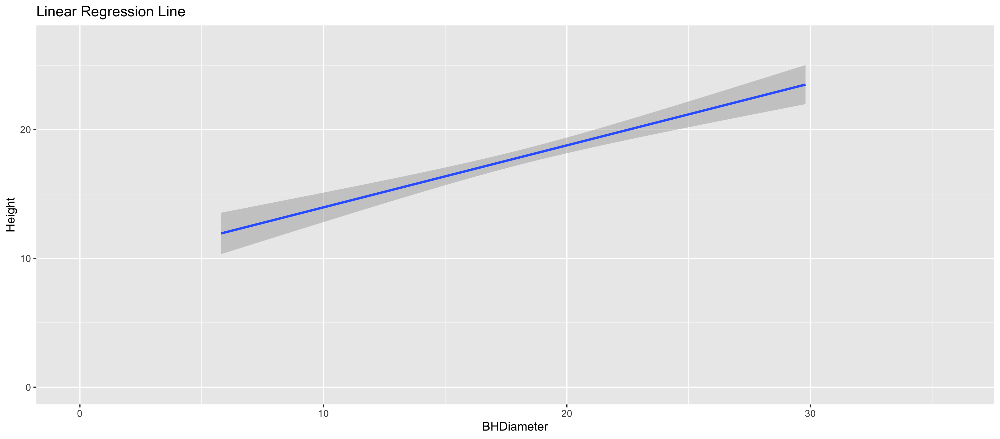
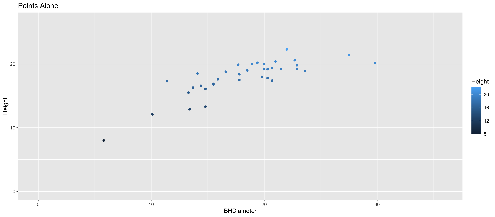
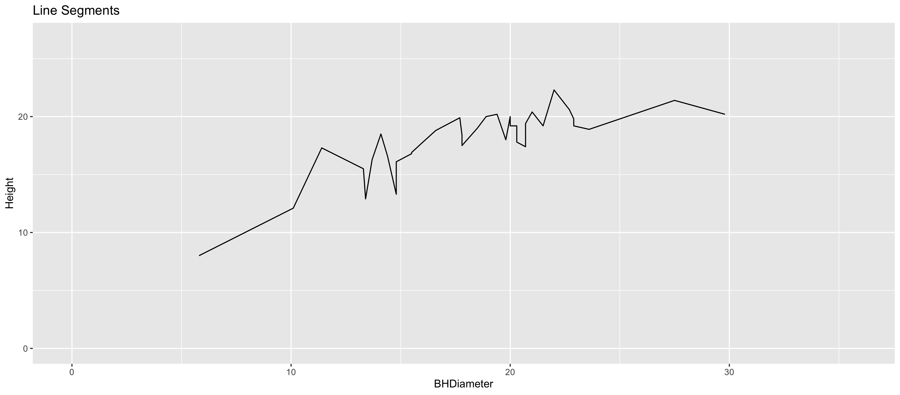

```{r setup, include=FALSE}
knitr::opts_chunk$set(echo = TRUE)
```

# Task 1

Working Directory: 

```{r}
getwd()
```

# Task 2

```{r}
spruce.df = read.csv("SPRUCE.csv")
head(spruce.df)
```


# Task 3

## Scatter Plot

```{r}
with(spruce.df, 
     plot(Height~BHDiameter, main = "Scatter Plot: Height vs BHDiameter", xlab= "Breast Height Diameter", ylab = "Height", bg="Blue",cex =1.2, pch=21,ylim=c(0,1.1*max(Height)),xlim=c(0,1.1*max(BHDiameter)))
)
```


## Does there appeare to be a straight line relationship? 

Answer: 
The graph is not naturally a straight line, it appears more like a curve. 

## Lowess smoother scatter plot (f=0.5,0.6,0.7) 

```{r}
library(s20x)
layout(matrix(1:3,nr=3,nc=1,byrow=TRUE))
trendscatter(Height~BHDiameter, f = 0.5, data = spruce.df)
trendscatter(Height~BHDiameter, f = 0.6, data = spruce.df)
trendscatter(Height~BHDiameter, f = 0.7, data = spruce.df)

```

## Linear model object using lm

```{r}
spruce.lm = with(spruce.df, lm(Height~BHDiameter))
spruce.lm
```

## Scatter plot with the least squares regression line

```{r}
with(spruce.df, 
     plot(Height~BHDiameter,bg="Blue",pch=21,ylim=c(0,1.1*max(Height)),xlim=c(0,1.1*max(BHDiameter)))
)
abline(spruce.lm)
yhat=fitted(spruce.lm)

```


In this graph, a straight line doesn't seem appropriate because the points are quite widely dispersed around the regression line and they are not fitted close to the line. Therefore, a straight line relationship would be misleading. The graph would be better represented with a smoother curve. 

# Task 4

```{r}
layout(matrix(1:4,nr=2,nc=2,byrow=TRUE))
with(spruce.df, plot(Height~BHDiameter,bg="Blue",pch=21,ylim=c(0,1.1*max(Height)),xlim=c(0,1.1*max(BHDiameter))))
abline(spruce.lm)

with(spruce.df, plot(Height~BHDiameter,bg="Blue",pch=21,ylim=c(0,1.1*max(Height)),xlim=c(0,1.1*max(BHDiameter))))
abline(spruce.lm)
with(spruce.df,{
segments(BHDiameter,Height,BHDiameter,yhat, col = "Blue")
})

with(spruce.df, plot(Height~BHDiameter,bg="Blue",pch=21,ylim=c(0,1.1*max(Height)),xlim=c(0,1.1*max(BHDiameter))))
with(spruce.df, abline(h=mean(Height)))
abline(spruce.lm)
with(spruce.df, segments(BHDiameter,mean(Height),BHDiameter,yhat,col="Red"))

with(spruce.df, plot(Height~BHDiameter,bg="Blue",pch=21,ylim=c(0,1.1*max(Height)),xlim=c(0,1.1*max(BHDiameter))))
with(spruce.df,abline(h=mean(Height)))
with(spruce.df, segments(BHDiameter,Height,BHDiameter,mean(Height),col="Green"))

```

## TSS, MSS, RSS calculations

TSS value: 

```{r}
TSS=with(spruce.df,sum((Height-mean(Height))^2))
TSS
```

MSS value: 

```{r}
MSS=with(spruce.df,sum((yhat-mean(Height))^2))
MSS
```

RSS value: 

```{r}
RSS=with(spruce.df,sum((Height-yhat)^2))
RSS
```

MSS/TSS: 

```{r}
MSS/TSS
```


The value of RSS^2 = MSS/RSS = 0.6569146. The closer the value of RSS^2 is to 1, the more fitted are the points to the regression line. The farther away is the value to 1, the more scattered are the points. In this this case, the points are pretty widely dispersed around the regression line. 


## Does TSS=MSS+RSS?

```{r}
MSS+RSS
TSS
```

Yes, the value of TSS = MSS + RSS


# Task 5

```{r}
summary(spruce.lm)
```
### Slope

The slope value is 0.4815

### Intercept

The intercept value is 9.1468

### Equation of the fitted line

```{r}
coef(spruce.lm)
```

The equation of the fitted line is: 

Height = 9.1468390 + 0.4814743 * BHDiameter

### Predict the Height of spruce

```{r}
new.height = data.frame(
  BHDiameter = c(15, 18, 20)
)

yhat = with(spruce.df, predict(spruce.lm, newdata = new.height))
yhat
```

# Task 6: Plot of Height vs Diameter using ggplot2

```{r}
library(ggplot2)
g=ggplot(spruce.df, aes(x=Height,y=BHDiameter,colour=Height))
g=g+geom_point() + geom_line()+ geom_smooth(method="lm")
g+ggtitle("Height Vs BHDiameter")
```

# Task 7: Images from shiny document

Images from interactive shiny document.

<center>
{ width=70% }

{ width=70% }
{ width=70% }
</center>


